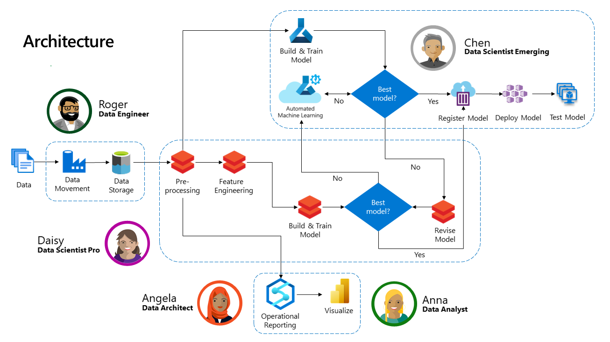
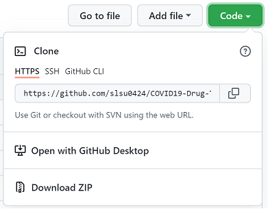

# Drug Therapy Risk Prediction Accelerator


The Drug Therapy Risk Prediction Accelerator was created for COVID-19 drug therapy therefore you will see COVID-19 mentioned in this repository. **This accelerator can be used for other drugs**. It is an end-to-end analytics platform that predicts the likelihood of a patient to experience a fatal adverse event (death) after receiving drug therapy. The accelerator incorporates real-world data from the [State Drug Utilization Database](https://www.medicaid.gov/medicaid/prescription-drugs/state-drug-utilization-data/index.html) (SDUD) and the [FDA Adverse Events Database](https://www.fda.gov/drugs/drug-approvals-and-databases/fda-adverse-event-reporting-system-faers) (FAERS).   

The accelerator uses the SDUD data to first build a retrospective analysis to identify drug prescription trends between the years 2018-2021, particularly during the onset of COVID-19 in 2019. Next, a prospective analysis looks at FDA adverse events associated with these drugs between 2019-2021. A machine learning (ML) model is built to predict the likelihood of a fatal adverse event, and identify the patient characteristics associated with this outcome.    

The accelerator can be used in a provider organization covering multiple personas, ranging from backend engineers to frontend clinical users. 

For technical users, a Data Engineer can quickly ingest SDUD and FAERS data through a low-code, no-code experience. A Data Architect can use a flexible, scalable analytics platform to query a data lake, anonymize sensitive patient information, and generate operational reports using familiar SQL language. The Data Analyst uses a visualization platform to plot trends observed in the data. Professional Data Scientists and Citizen Data Scientists have the ability to build and train machine learning models using traditional and/or automated ML methods, and register and deploy the model for real-time inferencing. 

For clinical users, an informatics team at a hospital may be interested in building a customized clinical surveillance dashboard to observe nationwide trends for clinical adverse events. A patient may be interested in understanding their own risk for taking off-label drugs for symptomatic disease. A physician can input patient characteristics into the model to assess drug risk, with the goal of providing the right therapy to the right patient at the right time.

## Architecture Overview
The architecture diagram below details what will be built with this accelerator.



## Prerequisites
To use this accelerator, you will need to have access to and/or provision the following applications:

1. Access to an [Azure Subscription ](http://portal.azure.com)
2. [Power Apps](http://www.powerapps.com) License (or free trial)
3. [PowerShell 7.1](https://docs.microsoft.com/en-us/powershell/scripting/install/installing-powershell?view=powershell-7.1)
4. [Azure CLI](https://docs.microsoft.com/en-us/cli/azure/install-azure-cli)
5. [Databricks CLI](https://docs.microsoft.com/en-us/azure/databricks/dev-tools/cli/)

A working knowledge of Azure, Azure Data Factory, Azure Databricks, Azure Synapse Analytics, Azure Machine Learning, Azure Container Services, and PowerBI will also be helpful.  To learn more about these services, please visit:
1. [Azure Data Factory](https://azure.microsoft.com/en-us/services/data-factory/)
2. [Azure Databricks](https://azure.microsoft.com/en-us/services/databricks/)
3. [Azure Synapse Analytics](https://azure.microsoft.com/en-us/services/synapse-analytics/)
4. [Azure Machine Learning](https://azure.microsoft.com/en-us/services/machine-learning/)
5. [Azure Container Instances](https://azure.microsoft.com/en-us/services/container-instances/)
5. [Power BI](https://powerbi.microsoft.com/en-us/)


## Getting Started
1. An [ARM](https://docs.microsoft.com/en-us/azure/azure-resource-manager/templates/overview) template deploys and configures all the resources required to run the accelerator. Click the Deploy to Azure button below:

    [](https://portal.azure.com/#create/Microsoft.Template/uri/https%3A%2F%2Fraw.githubusercontent.com%2Fslsu0424%2FCOVID19-Drug-Therapies%2Fmain%2F02-Deployment%2Fcovid_azuredeploy.json)

    The only 2 required parameters during the set-up are:

    - **Admin Password** for the Synapse Dedicated SQL Pool being deployed.
    - **Prefix ID** to preface the resources with a unique name you can later reference.

2. Clone or download this repository and navigate to the project's root directory.

    Option 1: In Windows Terminal, clone the GitHub repo:

      ```bash
      git clone https://github.com/slsu0424/COVID19-Drug-Therapies.git
      ```

    Option 2: Navigate towards the top right of this screen, and expand the **Code** button menu:

      

  
3. Go to the [Deployment Guide](./02-Deployment/Deployment.md) under [./02-Deployment](./02-Deployment) to complete the solution setup.

  > **NOTE**: Be sure to manually pause the SQL pool when you are not using it from the Synapse Workspace to reduce cost. Follow the steps below to pause the SQL pool:  
  > * Navigate to the Synapse workspace
  > *  Go to `Manage` > `SQL pools` > Pause the SQL pool 

## Folders
## [01-Presentations](./01-Presentations)
This folder contains an Executive Overview and Technical Design for the accelerator. In addition, a video provides a detailed walkthrough of the accelerator setup.

## [02-Deployment](./02-Deployment)
This folder contains the scripts used to deploy the required resources into your Azure Subscription. This can be done using the scripts or Azure Portal.  The [Deployment Guide](./02-Deployment/Deployment.md) is provided to help complete the rest of the accelerator setup.

## [03-Data Engineering](./03-DataEngineering)
This folder contains the JSON templates needed to complete the data engineering tasks outlined in the Deployment Guide. You will use the content in this folder following the instructions in the Deployment Guide.

## [04-Analytics & Reporting](./04-Analytics&Reporting)
This folder contains the Notebooks and SQL Scripts needed to complete the tasks to prepare the data for operational reporting and reports. You will use the content in this folder following the instructions in the Deployment Guide.

## [05-Data Science & Machine Learning](./05-DataScience&MachineLearning)
This folder contains the Notebooks needed to complete the tasks for building a machine learning model. You will use the content in this folder following the instructions in the Deployment Guide.

## [06-Frontend](./06-FrontEnd)
This folder contains the Web-based User Interface to be used by a end user.

## License
Copyright (c) Microsoft Corporation

All rights reserved.

MIT License

Permission is hereby granted, free of charge, to any person obtaining a copy of this software and associated documentation files (the ""Software""), to deal in the Software without restriction, including without limitation the rights to use, copy, modify, merge, publish, distribute, sublicense, and/or sell copies of the Software, and to permit persons to whom the Software is furnished to do so, subject to the following conditions:

The above copyright notice and this permission notice shall be included in all copies or substantial portions of the Software.

THE SOFTWARE IS PROVIDED AS IS, WITHOUT WARRANTY OF ANY KIND, EXPRESS OR IMPLIED, INCLUDING BUT NOT LIMITED TO THE WARRANTIES OF MERCHANTABILITY, FITNESS FOR A PARTICULAR PURPOSE AND NONINFRINGEMENT. IN NO EVENT SHALL THE AUTHORS OR COPYRIGHT HOLDERS BE LIABLE FOR ANY CLAIM, DAMAGES OR OTHER LIABILITY, WHETHER IN AN ACTION OF CONTRACT, TORT OR OTHERWISE, ARISING FROM, OUT OF OR IN CONNECTION WITH THE SOFTWARE OR THE USE OR OTHER DEALINGS IN THE SOFTWARE


## Contributing

This project welcomes contributions and suggestions.  Most contributions require you to agree to a
Contributor License Agreement (CLA) declaring that you have the right to, and actually do, grant us
the rights to use your contribution. For details, visit https://cla.opensource.microsoft.com.

When you submit a pull request, a CLA bot will automatically determine whether you need to provide
a CLA and decorate the PR appropriately (e.g., status check, comment). Simply follow the instructions
provided by the bot. You will only need to do this once across all repos using our CLA.

This project has adopted the [Microsoft Open Source Code of Conduct](https://opensource.microsoft.com/codeofconduct/).
For more information see the [Code of Conduct FAQ](https://opensource.microsoft.com/codeofconduct/faq/) or
contact [opencode@microsoft.com](mailto:opencode@microsoft.com) with any additional questions or comments.

## Trademarks

This project may contain trademarks or logos for projects, products, or services. Authorized use of Microsoft trademarks or logos is subject to and must follow 
[Microsoft's Trademark & Brand Guidelines](https://www.microsoft.com/en-us/legal/intellectualproperty/trademarks/usage/general).
Use of Microsoft trademarks or logos in modified versions of this project must not cause confusion or imply Microsoft sponsorship.
Any use of third-party trademarks or logos are subject to those third-party's policies.

## Acknowledgements

This project is developed as part of the Microsoft Healthcare & Life Sciences Customer Success Unit Data Science & AI Transformational Projects Initiative.

Author: Sandy Su
